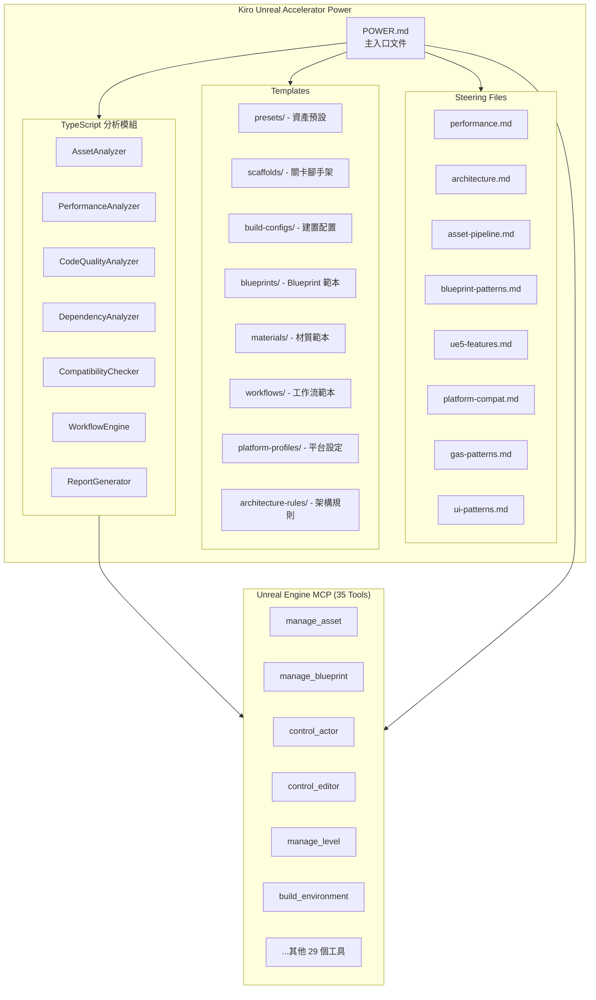

# 技術設計文件：Kiro Unreal Accelerator Power

## 概述

Kiro Unreal Accelerator Power 是一個 Kiro Power 擴展模組，透過整合 Unreal Engine MCP 的 35 個工具，讓 Kiro 成為 Unreal Engine 開發的智慧助手。開發者可以使用自然語言操控 Unreal Editor，自動化資產管理、關卡建置、效能分析、Blueprint 生成等工作流程。

本系統採用分層架構：
- **POWER.md** 作為 Kiro 的主入口文件，定義能力與工具映射
- **Steering Files** 提供 Unreal Engine 領域知識與最佳實踐
- **Templates** 提供預設範本（Asset Preset、Level Scaffold、Build Config 等）
- **TypeScript 分析模組** 提供深度分析能力（資產、效能、程式碼品質）

系統透過 MCP 協議與 Unreal Editor 通訊，所有操作均透過 MCP 工具執行，不直接修改 Unreal 專案檔案。

## 架構

### 系統架構圖



### 分層架構

```
┌─────────────────────────────────────────────────┐
│                  Kiro AI Agent                   │
├─────────────────────────────────────────────────┤
│              POWER.md (入口層)                    │
│  - 能力宣告與工具映射                              │
│  - 意圖識別與路由規則                              │
│  - MCP 工具使用指引                               │
├─────────────────────────────────────────────────┤
│           Steering Files (知識層)                 │
│  - 領域最佳實踐                                   │
│  - 架構規範與反模式                                │
│  - UE5 特性指引                                   │
├─────────────────────────────────────────────────┤
│            Templates (範本層)                     │
│  - Asset Presets / Level Scaffolds               │
│  - Blueprint / Material / UI 範本                │
│  - Build Config / Platform Profile               │
├─────────────────────────────────────────────────┤
│        TypeScript Analysis (分析層)               │
│  - 資產分析 / 效能分析 / 品質分析                   │
│  - 依賴分析 / 相容性檢查                           │
│  - 工作流引擎 / 報告生成                           │
├─────────────────────────────────────────────────┤
│         Unreal Engine MCP (工具層)                │
│  - 35 個 MCP 工具                                │
│  - 與 Unreal Editor 直接通訊                      │
└─────────────────────────────────────────────────┘
```

### 設計決策

1. **靜態知識 vs 動態分析分離**：Steering Files 與 Templates 為靜態文件，Kiro 直接讀取；TypeScript 模組負責需要運算的動態分析。這樣 Kiro 可以快速取得知識，同時保有深度分析能力。

2. **MCP 工具直接映射**：POWER.md 中定義每個使用者意圖對應的 MCP 工具組合，避免中間抽象層，減少延遲與複雜度。

3. **範本驅動生成**：所有生成操作（Blueprint、Material、Level 等）均基於 JSON 範本，範本定義結構與參數，MCP 工具負責執行。這讓範本可以獨立於程式碼更新。

4. **增量分析策略**：TypeScript 分析模組支援增量分析，透過檔案雜湊快取避免重複掃描，提升大型專案的分析效率。


## 元件與介面

### 1. POWER.md 主入口文件

POWER.md 是 Kiro 讀取的主文件，定義 Power 的能力、工具映射與使用指引。

```markdown
# Kiro Unreal Accelerator Power

## 能力宣告
- 資產管理與自動化設定
- 關卡建置與腳手架生成
- Blueprint 生成與最佳化
- 材質工作流自動化
- 效能分析與最佳化建議
- 程式碼品質檢查
- 跨平台相容性驗證
- GAS 系統整合
- AI 行為樹生成
- UI Widget 工具鏈

## MCP 工具映射
[意圖 -> 工具組合的映射表]

## Steering Files 索引
[領域知識文件的索引與用途說明]

## Templates 索引
[範本文件的索引與用途說明]
```

### 2. Steering Files 結構

每個 Steering File 專注於一個領域，提供 Kiro 該領域的知識與規範。

#### 2.1 steering/performance.md
```markdown
# Unreal Engine 效能最佳實踐

## Draw Call 最佳化
- 使用 Instanced Static Mesh 合併相同網格
- 啟用 Nanite 處理高面數資產
- 合理設定 LOD 距離

## 記憶體管理
- Texture Streaming 設定指引
- Asset 載入策略（Soft Reference vs Hard Reference）
- World Partition 串流設定

## GPU 最佳化
- Lumen 設定與效能權衡
- Nanite 適用場景與限制
- Shader 複雜度控制

## 常見反模式
- 過多動態光源
- Tick 函數濫用
- 未壓縮的貼圖
```

#### 2.2 steering/architecture.md
```markdown
# Unreal Engine 架構規範

## Blueprint vs C++ 職責分配
- C++：核心邏輯、效能敏感程式碼、基礎類別
- Blueprint：遊戲邏輯、快速迭代、設計師可調參數

## 模組化設計
- 功能模組劃分原則
- 依賴方向規則
- 介面設計模式

## 命名規範
- 資產命名：[Type]_[Name]_[Variant]
- Blueprint 命名：BP_[Category]_[Name]
- 資料夾結構規範
```

#### 2.3 steering/ue5-features.md
```markdown
# Unreal Engine 5 特性指引

## Nanite
- 適用場景：靜態高面數網格
- 限制：不支援骨骼網格、變形
- 設定建議：Fallback Mesh 設定

## Lumen
- Global Illumination 設定
- Reflection 設定
- 效能與品質權衡

## World Partition
- 分區網格大小設定
- 串流距離設定
- Data Layer 使用時機

## Control Rig
- 程序化動畫設定
- IK 設定指引
```

#### 2.4 steering/gas-patterns.md
```markdown
# Gameplay Ability System 模式

## Ability 設計模式
- 技能生命週期
- 輸入綁定策略
- 技能取消與中斷

## Effect 設計模式
- Instant vs Duration vs Infinite
- Stacking 策略
- Modifier 計算順序

## Attribute 設計模式
- 基礎屬性 vs 衍生屬性
- Clamping 策略
- 屬性變更通知

## Tag 系統
- Tag 階層設計
- Blocking/Canceling Tag
- Owned Tag 管理
```

### 3. Templates 結構

#### 3.1 templates/presets/ - 資產預設

```json
// presets/texture-2d-diffuse.json
{
  "name": "Texture2D_Diffuse",
  "assetType": "Texture2D",
  "description": "標準 Diffuse 貼圖預設",
  "settings": {
    "compressionSettings": "TC_Default",
    "mipmapGenSettings": "TMGS_FromTextureGroup",
    "textureGroup": "TEXTUREGROUP_World",
    "sRGB": true,
    "maxTextureSize": 2048,
    "lodBias": 0
  },
  "validations": [
    { "check": "powerOfTwo", "message": "貼圖尺寸必須為 2 的冪次" }
  ]
}
```

```json
// presets/static-mesh-nanite.json
{
  "name": "StaticMesh_Nanite",
  "assetType": "StaticMesh",
  "description": "Nanite 靜態網格預設",
  "settings": {
    "naniteEnabled": true,
    "nanitePositionPrecision": 0,
    "generateDistanceFieldAsIfStatic": true,
    "supportUniformlyDistributedSampling": false
  },
  "requirements": [
    { "check": "minTriangleCount", "value": 10000, "message": "Nanite 適用於高面數網格" },
    { "check": "noSkinning", "message": "Nanite 不支援骨骼網格" }
  ]
}
```

#### 3.2 templates/scaffolds/ - 關卡腳手架

```json
// scaffolds/open-world.json
{
  "name": "OpenWorld",
  "description": "開放世界關卡腳手架",
  "worldPartition": {
    "enabled": true,
    "cellSize": 12800,
    "loadingRange": 25600
  },
  "dataLayers": [
    { "name": "Landscape", "initialState": "Activated" },
    { "name": "Buildings", "initialState": "Activated" },
    { "name": "Foliage", "initialState": "Activated" },
    { "name": "Audio", "initialState": "Activated" }
  ],
  "actors": [
    { "class": "DirectionalLight", "name": "SunLight", "mobility": "Stationary" },
    { "class": "SkyLight", "name": "SkyLight", "mobility": "Stationary" },
    { "class": "SkyAtmosphere", "name": "SkyAtmosphere" },
    { "class": "ExponentialHeightFog", "name": "HeightFog" },
    { "class": "PostProcessVolume", "name": "GlobalPostProcess", "infinite": true }
  ],
  "folders": [
    "Lighting", "Environment", "Gameplay", "Audio", "VFX"
  ]
}
```

#### 3.3 templates/blueprints/ - Blueprint 範本

```json
// blueprints/character-base.json
{
  "name": "BP_Character_Base",
  "parentClass": "Character",
  "description": "基礎角色 Blueprint 範本",
  "components": [
    { "name": "CameraBoom", "class": "SpringArmComponent", "attachTo": "RootComponent" },
    { "name": "FollowCamera", "class": "CameraComponent", "attachTo": "CameraBoom" },
    { "name": "AbilitySystemComponent", "class": "AbilitySystemComponent" }
  ],
  "variables": [
    { "name": "MaxHealth", "type": "float", "default": 100.0, "category": "Stats" },
    { "name": "MoveSpeed", "type": "float", "default": 600.0, "category": "Movement" }
  ],
  "functions": [
    { "name": "InitializeAbilities", "category": "GAS" },
    { "name": "HandleDamage", "category": "Combat", "inputs": ["DamageAmount", "DamageType"] }
  ],
  "events": [
    { "name": "OnHealthChanged", "category": "Stats" },
    { "name": "OnDeath", "category": "Combat" }
  ]
}
```

#### 3.4 templates/materials/ - 材質範本

```json
// materials/pbr-standard.json
{
  "name": "M_PBR_Standard",
  "description": "標準 PBR 材質範本",
  "domain": "Surface",
  "blendMode": "Opaque",
  "shadingModel": "DefaultLit",
  "parameters": [
    { "name": "BaseColor", "type": "Texture2D", "default": null },
    { "name": "Normal", "type": "Texture2D", "default": null },
    { "name": "ORM", "type": "Texture2D", "default": null, "description": "Occlusion/Roughness/Metallic packed" },
    { "name": "Tint", "type": "LinearColor", "default": [1, 1, 1, 1] },
    { "name": "RoughnessMultiplier", "type": "float", "default": 1.0, "range": [0, 1] }
  ],
  "nodes": [
    { "type": "TextureSample", "name": "BaseColorSample", "texture": "BaseColor" },
    { "type": "TextureSample", "name": "NormalSample", "texture": "Normal" },
    { "type": "TextureSample", "name": "ORMSample", "texture": "ORM" }
  ]
}
```


### 4. TypeScript 分析模組介面

#### 4.1 AssetAnalyzer

```typescript
interface AssetPreset {
  name: string;
  assetType: AssetType;
  description: string;
  settings: Record<string, unknown>;
  validations?: ValidationRule[];
  requirements?: RequirementCheck[];
}

type AssetType = 
  | 'Texture2D' | 'StaticMesh' | 'SkeletalMesh' 
  | 'Material' | 'MaterialInstance' | 'SoundWave' 
  | 'SoundCue' | 'Blueprint' | 'AnimSequence'
  | 'AnimMontage' | 'ParticleSystem' | 'NiagaraSystem';

interface ValidationRule {
  check: string;
  value?: number | string;
  message: string;
}

interface RequirementCheck {
  check: string;
  value?: number | string;
  message: string;
}

interface AssetAnalysisResult {
  assetPath: string;
  assetType: AssetType;
  detectedIssues: Issue[];
  suggestedPreset: string | null;
  naniteCompatible: boolean;
  estimatedMemory: number;
}

interface AssetAnalyzer {
  analyzeAsset(assetPath: string): Promise<AssetAnalysisResult>;
  batchApplyPreset(assetPaths: string[], preset: AssetPreset): Promise<ApplyResult[]>;
  detectAssetType(assetPath: string): Promise<AssetType>;
  validateNaniteCompatibility(meshPath: string): Promise<NaniteValidation>;
}
```

#### 4.2 PerformanceAnalyzer

```typescript
interface PerformanceReport {
  timestamp: string;
  summary: PerformanceSummary;
  drawCallAnalysis: DrawCallAnalysis;
  memoryAnalysis: MemoryAnalysis;
  gpuAnalysis: GpuAnalysis;
  naniteAnalysis: NaniteAnalysis;
  lumenAnalysis: LumenAnalysis;
  antiPatterns: AntiPattern[];
  recommendations: Recommendation[];
}

interface PerformanceSummary {
  overallScore: number;        // 0-100
  criticalIssues: number;
  warnings: number;
  estimatedFps: { low: number; mid: number; high: number };
}

interface AntiPattern {
  id: string;
  severity: 'critical' | 'warning' | 'info';
  category: string;
  description: string;
  affectedAssets: string[];
  fix: string;
  estimatedImprovement: string;
}

interface PerformanceAnalyzer {
  analyzeScene(): Promise<PerformanceReport>;
  profileDrawCalls(): Promise<DrawCallAnalysis>;
  profileMemory(): Promise<MemoryAnalysis>;
  analyzeNaniteUsage(): Promise<NaniteAnalysis>;
  analyzeLumenSettings(): Promise<LumenAnalysis>;
  detectAntiPatterns(): Promise<AntiPattern[]>;
}
```

#### 4.3 CodeQualityAnalyzer

```typescript
interface CodeQualityReport {
  timestamp: string;
  summary: QualitySummary;
  namingViolations: NamingViolation[];
  circularDependencies: CircularDependency[];
  blueprintCppBalance: BalanceAnalysis;
  architectureIssues: ArchitectureIssue[];
  recommendations: Recommendation[];
}

interface NamingViolation {
  assetPath: string;
  currentName: string;
  expectedPattern: string;
  suggestedName: string;
}

interface CircularDependency {
  chain: string[];
  severity: 'critical' | 'warning';
  suggestedFix: string;
}

interface CodeQualityAnalyzer {
  analyzeProject(): Promise<CodeQualityReport>;
  checkNamingConventions(paths: string[]): Promise<NamingViolation[]>;
  detectCircularDependencies(): Promise<CircularDependency[]>;
  analyzeBlueprintCppBalance(): Promise<BalanceAnalysis>;
  suggestRefactoring(assetPath: string): Promise<RefactoringSuggestion[]>;
}
```

#### 4.4 DependencyAnalyzer

```typescript
interface DependencyTree {
  root: string;
  directDependencies: DependencyNode[];
  totalDependencyCount: number;
  maxDepth: number;
}

interface DependencyNode {
  assetPath: string;
  assetType: AssetType;
  dependencies: DependencyNode[];
  referencedBy: string[];
  chunkId?: number;
}

interface OrphanedAsset {
  assetPath: string;
  assetType: AssetType;
  estimatedSize: number;
  suggestion: 'delete' | 'reconnect';
}

interface DependencyAnalyzer {
  buildDependencyTree(assetPath: string): Promise<DependencyTree>;
  findOrphanedAssets(): Promise<OrphanedAsset[]>;
  analyzeChunkDuplication(): Promise<ChunkDuplicationReport>;
  getImpactAnalysis(assetPath: string): Promise<ImpactAnalysis>;
  analyzeWorldPartitionDependencies(): Promise<WorldPartitionDependencyReport>;
}
```

#### 4.5 CompatibilityChecker

```typescript
type Severity = 'critical' | 'warning' | 'info';

interface CompatibilityIssue {
  id: string;
  severity: Severity;
  platform: TargetPlatform;
  category: 'shader' | 'memory' | 'feature' | 'input' | 'rendering';
  description: string;
  affectedAssets: string[];
  fix: string;
}

type TargetPlatform = 
  | 'Windows' | 'Mac' | 'Linux' 
  | 'iOS' | 'Android' 
  | 'PS5' | 'XboxSeriesX' | 'Switch';

interface CompatibilityReport {
  targetPlatform: TargetPlatform;
  issues: CompatibilityIssue[];
  shaderCompatibility: ShaderCompatibility;
  memoryBudget: MemoryBudgetAnalysis;
  canBuild: boolean;
  blockingIssues: CompatibilityIssue[];
}

interface CompatibilityChecker {
  checkPlatform(platform: TargetPlatform): Promise<CompatibilityReport>;
  checkShaderCompatibility(platform: TargetPlatform): Promise<ShaderCompatibility>;
  checkMemoryBudget(platform: TargetPlatform): Promise<MemoryBudgetAnalysis>;
  validateScalabilitySettings(): Promise<ScalabilityReport>;
}
```

#### 4.6 WorkflowEngine

```typescript
interface WorkflowDefinition {
  id: string;
  name: string;
  description: string;
  steps: WorkflowStep[];
  schedule?: CronExpression;
}

interface WorkflowStep {
  id: string;
  name: string;
  action: string;           // MCP 工具名稱或分析模組方法
  params: Record<string, unknown>;
  condition?: StepCondition;
  onFailure: 'stop' | 'skip' | 'retry';
  retryCount?: number;
}

interface StepCondition {
  field: string;             // 前一步驟結果的欄位路徑
  operator: 'eq' | 'neq' | 'gt' | 'lt' | 'contains';
  value: unknown;
}

interface WorkflowResult {
  workflowId: string;
  status: 'completed' | 'failed' | 'partial';
  stepResults: StepResult[];
  startTime: string;
  endTime: string;
  duration: number;
}

interface StepResult {
  stepId: string;
  status: 'success' | 'failed' | 'skipped';
  output: unknown;
  error?: string;
  duration: number;
}

interface WorkflowEngine {
  defineWorkflow(definition: WorkflowDefinition): Promise<void>;
  executeWorkflow(workflowId: string): Promise<WorkflowResult>;
  getWorkflowStatus(workflowId: string): Promise<WorkflowResult>;
  listWorkflows(): Promise<WorkflowDefinition[]>;
  scheduleWorkflow(workflowId: string, cron: string): Promise<void>;
}
```

#### 4.7 ReportGenerator

```typescript
type ReportFormat = 'json' | 'markdown';

interface ReportConfig {
  format: ReportFormat;
  includeCharts: boolean;
  sections: string[];
}

interface ReportGenerator {
  generateAssetReport(analysis: AssetAnalysisResult[], config: ReportConfig): Promise<string>;
  generatePerformanceReport(report: PerformanceReport, config: ReportConfig): Promise<string>;
  generateCodeQualityReport(report: CodeQualityReport, config: ReportConfig): Promise<string>;
  generateCompatibilityReport(report: CompatibilityReport, config: ReportConfig): Promise<string>;
  generateDashboard(reports: Record<string, unknown>): Promise<string>;
}
```


## 資料模型

### 1. 專案結構

```
kiro-unreal-accelerator/
├── POWER.md                           # Kiro 主入口文件
├── mcp.json                           # MCP Server 連線配置
├── steering/                          # Steering Files
│   ├── performance.md                 # 效能最佳實踐
│   ├── architecture.md                # 架構規範
│   ├── asset-pipeline.md              # 資產管線指引
│   ├── blueprint-patterns.md          # Blueprint 設計模式
│   ├── ue5-features.md                # UE5 特性指引
│   ├── platform-compat.md             # 平台相容性指引
│   ├── gas-patterns.md                # GAS 設計模式
│   └── ui-patterns.md                 # UI 設計模式
├── templates/                         # 範本檔案
│   ├── presets/                       # 資產預設
│   │   ├── texture-2d-diffuse.json
│   │   ├── texture-2d-normal.json
│   │   ├── static-mesh-nanite.json
│   │   ├── static-mesh-standard.json
│   │   ├── skeletal-mesh-character.json
│   │   ├── material-pbr.json
│   │   └── sound-sfx.json
│   ├── scaffolds/                     # 關卡腳手架
│   │   ├── open-world.json
│   │   ├── linear-level.json
│   │   ├── arena.json
│   │   └── interior.json
│   ├── blueprints/                    # Blueprint 範本
│   │   ├── character-base.json
│   │   ├── actor-interactable.json
│   │   ├── component-health.json
│   │   ├── widget-hud.json
│   │   ├── gamemode-base.json
│   │   └── ai-controller.json
│   ├── materials/                     # 材質範本
│   │   ├── pbr-standard.json
│   │   ├── pbr-subsurface.json
│   │   ├── landscape-blend.json
│   │   └── vfx-translucent.json
│   ├── gas/                           # GAS 範本
│   │   ├── ability-melee.json
│   │   ├── ability-projectile.json
│   │   ├── effect-damage.json
│   │   ├── effect-buff.json
│   │   └── attribute-set-base.json
│   ├── ai/                            # AI 範本
│   │   ├── behavior-tree-patrol.json
│   │   ├── behavior-tree-combat.json
│   │   ├── blackboard-npc.json
│   │   └── eqs-find-cover.json
│   ├── build-configs/                 # 建置配置
│   │   ├── development.json
│   │   ├── shipping.json
│   │   └── test.json
│   ├── platform-profiles/             # 平台設定檔
│   │   ├── windows.json
│   │   ├── ps5.json
│   │   ├── xbox-series-x.json
│   │   ├── ios.json
│   │   └── android.json
│   ├── architecture-rules/            # 架構規則
│   │   ├── naming-conventions.json
│   │   ├── folder-structure.json
│   │   └── dependency-rules.json
│   └── workflows/                     # 工作流範本
│       ├── asset-import-pipeline.json
│       ├── build-and-test.json
│       └── performance-audit.json
└── src/                               # TypeScript 分析模組
    ├── index.ts                       # 模組入口
    ├── analyzers/
    │   ├── AssetAnalyzer.ts
    │   ├── PerformanceAnalyzer.ts
    │   ├── CodeQualityAnalyzer.ts
    │   ├── DependencyAnalyzer.ts
    │   └── CompatibilityChecker.ts
    ├── engine/
    │   └── WorkflowEngine.ts
    ├── generators/
    │   └── ReportGenerator.ts
    ├── types/
    │   ├── asset.ts
    │   ├── analysis.ts
    │   ├── workflow.ts
    │   └── report.ts
    └── utils/
        ├── mcp-client.ts              # MCP 工具呼叫封裝
        ├── cache.ts                   # 增量分析快取
        └── logger.ts
```

### 2. MCP 連線配置

```json
// mcp.json
{
  "mcpServers": {
    "unreal-engine": {
      "command": "npx",
      "args": ["-y", "@anthropic/unreal-engine-mcp"],
      "env": {
        "UE_PROJECT_PATH": "${workspaceFolder}"
      }
    }
  }
}
```

### 3. 核心資料結構

#### 3.1 Issue 與 Recommendation

```typescript
interface Issue {
  id: string;
  severity: 'critical' | 'warning' | 'info';
  category: string;
  title: string;
  description: string;
  affectedAssets: string[];
  location?: {
    file: string;
    line?: number;
  };
}

interface Recommendation {
  id: string;
  priority: 'high' | 'medium' | 'low';
  category: string;
  title: string;
  description: string;
  steps: string[];
  estimatedImpact: string;
  relatedIssues: string[];
}
```

#### 3.2 分析快取

```typescript
interface AnalysisCache {
  version: string;
  lastFullScan: string;
  fileHashes: Record<string, string>;
  cachedResults: Record<string, CachedAnalysis>;
}

interface CachedAnalysis {
  assetPath: string;
  hash: string;
  timestamp: string;
  result: unknown;
}
```

### 4. MCP 工具映射表

| 使用者意圖 | 主要 MCP 工具 | 輔助工具 |
|-----------|--------------|---------|
| 建立 Blueprint | manage_blueprint | inspect |
| 生成關卡結構 | manage_level, control_actor | manage_level_structure |
| 套用資產預設 | manage_asset | inspect |
| 建立材質 | manage_material_authoring | manage_texture |
| 設定 Nanite | manage_asset | manage_geometry |
| 建立 AI 行為 | manage_behavior_tree, manage_ai | manage_blueprint |
| 設定 GAS | manage_gas | manage_blueprint |
| 建立 UI | manage_widget_authoring | manage_blueprint |
| 效能分析 | manage_performance | inspect |
| 建置專案 | system_control | control_editor |
| 設定光照 | manage_lighting | build_environment |
| 建立動畫 | animation_physics | manage_skeleton |
| 設定導航 | manage_navigation | manage_volumes |
| 建立音訊 | manage_audio | manage_asset |
| 設定網路 | manage_networking | manage_game_framework |


## 正確性屬性（Correctness Properties）

*正確性屬性是一種在系統所有有效執行中都應成立的特徵或行為——本質上是對系統應做什麼的形式化陳述。屬性作為人類可讀規格與機器可驗證正確性保證之間的橋樑。*

### Property 1: 資產預設套用與驗證一致性

*For any* 資產列表與預設設定，當批次套用預設時，所有通過驗證的資產應具有預設定義的設定值，所有未通過驗證的資產應回傳非空的不相容原因與至少一個替代建議。特別地，對任何靜態網格套用 Nanite 預設時，驗證結果應正確反映該網格是否符合 Nanite 需求（高面數、無骨骼綁定）。

**Validates: Requirements 1.1, 1.3, 1.4**

### Property 2: 資產類型偵測正確性

*For any* 資產元資料，資產類型偵測器應回傳一個有效的 AssetType 值，且建議的預設設定應與偵測到的資產類型相容。

**Validates: Requirements 1.2**

### Property 3: 關卡腳手架生成完整性

*For any* 有效的關卡範本定義，腳手架生成器產出的關卡結構應包含範本中定義的所有 Actor、設定與資料夾階層，且所有命名應符合架構規則中定義的命名規範。

**Validates: Requirements 2.1, 2.3**

### Property 4: 外掛依賴檢查

*For any* 包含外掛需求的關卡範本，腳手架生成器應在生成前檢查所有必要外掛的可用性，並對缺失的外掛回傳明確的提示訊息。

**Validates: Requirements 2.5**

### Property 5: 分析報告完整性

*For any* 分析結果資料（效能、建置、相容性），報告生成器產出的報告應包含所有必要欄位：效能報告包含 Draw Call 統計、記憶體使用與 GPU 時間；建置報告包含檔案大小、建置時間與警告統計；相容性報告包含問題列表與嚴重度。且 JSON 格式輸出應為有效 JSON，Markdown 格式輸出應為有效 Markdown。

**Validates: Requirements 3.2, 4.2, 6.2, 18.2**

### Property 6: 建置錯誤解析

*For any* 建置錯誤訊息，錯誤解析器應回傳非空的修復建議，且建議應包含具體的修復步驟。

**Validates: Requirements 3.4**

### Property 7: 工作流定義儲存往返

*For any* 有效的工作流定義，儲存後再載入應產出與原始定義等價的物件。

**Validates: Requirements 5.1**

### Property 8: 工作流執行順序與錯誤處理

*For any* 包含 N 個步驟的工作流，執行應產出恰好 N 個步驟結果且順序正確。若步驟 K 失敗且 onFailure 為 'stop'，則步驟 K+1 到 N 不應被執行。

**Validates: Requirements 5.2, 5.3**

### Property 9: 工作流條件分支

*For any* 包含條件分支的工作流，引擎應根據前一步驟的結果正確評估條件並選擇對應的分支路徑。

**Validates: Requirements 5.4**

### Property 10: 效能反模式偵測與建議

*For any* 場景配置中包含已知效能反模式（過多動態光源、未合併網格、過大貼圖、過高材質指令數、過多 Tick 更新），分析器應偵測到該反模式並提供包含具體最佳化步驟與預期改善幅度的建議。

**Validates: Requirements 6.3, 6.5, 12.4, 13.5, 15.4**

### Property 11: 命名規範檢查

*For any* 資產名稱，命名規範檢查器應根據架構規則正確識別違規，並對每個違規提供建議的正確名稱。

**Validates: Requirements 7.2**

### Property 12: 循環依賴偵測

*For any* 有向依賴圖，循環依賴偵測器應正確識別所有環路，且對每個環路提供解耦建議。

**Validates: Requirements 7.3**

### Property 13: 架構問題建議完整性

*For any* 偵測到的架構問題，系統應提供非空的重構建議。

**Validates: Requirements 7.5**

### Property 14: 文件過期偵測

*For any* 文件集合，最後更新時間超過閾值的文件應被標記為過期。

**Validates: Requirements 8.3**

### Property 15: 平台相容性檢查與建置阻擋

*For any* 專案配置與目標平台，相容性檢查器應正確識別 Shader 不相容（Feature Level / Shader Model）與記憶體超出預算的問題，每個問題的嚴重度必須為 Critical、Warning 或 Info 之一，且當存在至少一個 Critical 問題時，canBuild 應為 false。

**Validates: Requirements 9.2, 9.3, 9.4, 9.5**

### Property 16: 依賴樹完整性與影響分析

*For any* 資產依賴圖與根節點，依賴樹應包含從根節點可達的所有直接與間接依賴。反向地，對任何計畫刪除的資產，影響分析應列出所有直接或間接依賴該資產的參照。

**Validates: Requirements 10.1, 10.4**

### Property 17: 孤立資產偵測

*For any* 資產集合與依賴邊集合，沒有任何入邊的非根資產應被識別為孤立資產。

**Validates: Requirements 10.2**

### Property 18: Chunk 重複資產偵測

*For any* Chunk 分配方案，同一資產出現在多個 Chunk 中應被標記為重複。

**Validates: Requirements 10.3**

### Property 19: 範本生成完整性

*For any* 有效的元件類型（Blueprint、Material、AI、GAS、Widget），生成器產出的範本應包含該類型定義的所有必要元素（元件、變數、函數、事件、參數、節點）。

**Validates: Requirements 11.1, 11.4, 12.1, 13.4, 14.4, 15.1**

### Property 20: 材質實例批次建立

*For any* 材質與參數覆寫集合，批次建立的材質實例應具有正確的參數值。

**Validates: Requirements 12.3**

### Property 21: GAS 設定一致性檢查

*For any* GAS 配置集合（Ability、Effect、Attribute Set），一致性檢查器應偵測 Tag 衝突（如自我阻擋、矛盾的 Effect）。

**Validates: Requirements 14.5**

### Property 22: Steering File 載入

*For any* 有效的 Steering File，系統應能成功載入並解析其內容。

**Validates: Requirements 16.1**

### Property 23: 範本客製化與版本相容性

*For any* 範本與專案設定，客製化後的輸出應反映專案設定。且對任何範本與目標 Unreal Engine 版本，版本驗證器應正確判斷相容性。若範本引用已棄用的 API，系統應標記並建議替代方案。

**Validates: Requirements 17.2, 17.4, 17.5**

### Property 24: 自訂範本儲存往返

*For any* 自訂範本，儲存後再載入應產出與原始範本等價的物件。

**Validates: Requirements 17.3**

### Property 25: 增量分析效率

*For any* 檔案集合，其中僅部分檔案的雜湊值已變更，增量分析應僅處理變更的檔案，未變更的檔案應使用快取結果。

**Validates: Requirements 18.3**

### Property 26: 自訂分析規則套用

*For any* 自訂分析規則定義，分析器在執行時應套用該規則並在結果中反映規則的檢查結果。

**Validates: Requirements 18.5**

### Property 27: 知識文件儲存往返

*For any* 文件，儲存後以其鍵值查詢應回傳與原始文件等價的內容。

**Validates: Requirements 8.1**


## 錯誤處理

### 1. MCP 工具呼叫錯誤

| 錯誤類型 | 處理策略 |
|---------|---------|
| MCP 連線失敗 | 回報連線狀態，建議檢查 Unreal Editor 是否啟動且 MCP Server 是否運行 |
| 工具不存在 | 回報可用工具列表，建議檢查 MCP Server 版本 |
| 參數錯誤 | 解析錯誤訊息，提供正確的參數格式範例 |
| 執行逾時 | 回報逾時資訊，建議檢查 Unreal Editor 是否回應 |
| 權限不足 | 回報所需權限，建議檢查專案設定 |

### 2. 範本與預設錯誤

| 錯誤類型 | 處理策略 |
|---------|---------|
| 範本 JSON 解析失敗 | 回報語法錯誤位置，建議修正 JSON 格式 |
| 範本版本不相容 | 回報版本需求，建議升級範本或降級 UE 版本 |
| 預設驗證失敗 | 回報不相容原因，提供替代預設建議 |
| 範本缺少必要欄位 | 回報缺少的欄位，提供範本結構參考 |

### 3. 分析模組錯誤

| 錯誤類型 | 處理策略 |
|---------|---------|
| 資產路徑不存在 | 回報無效路徑，建議檢查資產是否已匯入 |
| 分析快取損壞 | 清除快取並執行完整掃描 |
| 記憶體不足 | 切換為分批分析模式，減少單次處理量 |
| 分析規則語法錯誤 | 回報規則錯誤位置，提供規則語法參考 |

### 4. 工作流錯誤

| 錯誤類型 | 處理策略 |
|---------|---------|
| 步驟執行失敗 | 根據 onFailure 設定決定：stop（暫停並回報）、skip（跳過並繼續）、retry（重試指定次數） |
| 條件評估失敗 | 回報條件表達式錯誤，暫停工作流 |
| 排程衝突 | 回報衝突的工作流，建議調整排程 |

### 5. 錯誤回報格式

所有錯誤統一使用以下結構回報：

```typescript
interface PowerError {
  code: string;           // 錯誤代碼，如 "MCP_CONNECTION_FAILED"
  severity: 'critical' | 'warning' | 'info';
  message: string;        // 人類可讀的錯誤描述
  context: {
    tool?: string;        // 相關的 MCP 工具
    asset?: string;       // 相關的資產路徑
    step?: string;        // 相關的工作流步驟
  };
  suggestion: string;     // 修復建議
  documentation?: string; // 相關文件連結
}
```

## 測試策略

### 測試方法

本專案採用雙軌測試策略：

1. **單元測試**：驗證具體範例、邊界情況與錯誤條件
2. **屬性測試（Property-Based Testing）**：驗證跨所有輸入的通用屬性

兩者互補，單元測試捕捉具體錯誤，屬性測試驗證通用正確性。

### 屬性測試框架

- **框架選擇**：[fast-check](https://github.com/dubzzz/fast-check)（TypeScript 屬性測試庫）
- **每個屬性測試最少執行 100 次迭代**
- **每個測試必須以註解標記對應的設計屬性**
- **標記格式**：`Feature: unreal-accelerator-power, Property {number}: {property_text}`
- **每個正確性屬性由單一屬性測試實作**

### 單元測試範圍

單元測試聚焦於：

- **具體範例**：驗證特定資產類型的預設套用（需求 1.5、11.2、11.3、12.2、13.2、13.3、14.2、14.3、15.2、15.3）
- **邊界情況**：World Partition 範本設定（需求 2.2）、Nanite/Lumen 專屬建議（需求 6.4）、過多貼圖取樣（需求 12.5）、過多 Tick 更新（需求 15.5）、Data Layer 依賴（需求 10.5）
- **整合驗證**：Steering File 載入（需求 16.2、16.4）、範本存在性（需求 2.4、3.3、4.3、17.1、18.1）、平台設定檔（需求 8.5）

### 屬性測試範圍

每個正確性屬性對應一個屬性測試：

| 屬性 | 測試描述 | 生成器 |
|------|---------|--------|
| Property 1 | 資產預設套用與驗證 | 隨機資產列表 + 預設設定 |
| Property 2 | 資產類型偵測 | 隨機資產元資料 |
| Property 3 | 關卡腳手架完整性 | 隨機關卡範本 |
| Property 4 | 外掛依賴檢查 | 隨機外掛需求列表 |
| Property 5 | 報告完整性 | 隨機分析結果資料 |
| Property 6 | 建置錯誤解析 | 隨機錯誤訊息字串 |
| Property 7 | 工作流定義往返 | 隨機工作流定義 |
| Property 8 | 工作流執行順序 | 隨機步驟列表 + 失敗位置 |
| Property 9 | 條件分支評估 | 隨機條件 + 步驟結果 |
| Property 10 | 反模式偵測 | 隨機場景配置 + 注入反模式 |
| Property 11 | 命名規範檢查 | 隨機資產名稱 |
| Property 12 | 循環依賴偵測 | 隨機有向圖 |
| Property 13 | 架構問題建議 | 隨機架構問題 |
| Property 14 | 文件過期偵測 | 隨機文件 + 時間戳 |
| Property 15 | 平台相容性 | 隨機配置 + 平台規格 |
| Property 16 | 依賴樹與影響分析 | 隨機 DAG |
| Property 17 | 孤立資產偵測 | 隨機圖 + 邊集合 |
| Property 18 | Chunk 重複偵測 | 隨機 Chunk 分配 |
| Property 19 | 範本生成完整性 | 隨機元件類型 |
| Property 20 | 材質實例批次建立 | 隨機參數覆寫 |
| Property 21 | GAS 一致性檢查 | 隨機 GAS 配置 |
| Property 22 | Steering File 載入 | 隨機有效 Steering File |
| Property 23 | 範本客製化與版本 | 隨機範本 + 專案設定 |
| Property 24 | 自訂範本往返 | 隨機自訂範本 |
| Property 25 | 增量分析效率 | 隨機檔案集合 + 雜湊 |
| Property 26 | 自訂規則套用 | 隨機分析規則 |
| Property 27 | 知識文件往返 | 隨機文件內容 |

### 測試檔案結構

```
src/
└── __tests__/
    ├── analyzers/
    │   ├── AssetAnalyzer.test.ts
    │   ├── AssetAnalyzer.property.test.ts
    │   ├── PerformanceAnalyzer.test.ts
    │   ├── PerformanceAnalyzer.property.test.ts
    │   ├── CodeQualityAnalyzer.test.ts
    │   ├── CodeQualityAnalyzer.property.test.ts
    │   ├── DependencyAnalyzer.test.ts
    │   ├── DependencyAnalyzer.property.test.ts
    │   ├── CompatibilityChecker.test.ts
    │   └── CompatibilityChecker.property.test.ts
    ├── engine/
    │   ├── WorkflowEngine.test.ts
    │   └── WorkflowEngine.property.test.ts
    ├── generators/
    │   ├── ReportGenerator.test.ts
    │   └── ReportGenerator.property.test.ts
    └── utils/
        └── cache.test.ts
```

### 屬性測試範例

```typescript
import fc from 'fast-check';

// Feature: unreal-accelerator-power, Property 7: 工作流定義儲存往返
describe('WorkflowEngine - Property Tests', () => {
  it('should round-trip workflow definitions', () => {
    const workflowArb = fc.record({
      id: fc.uuid(),
      name: fc.string({ minLength: 1 }),
      description: fc.string(),
      steps: fc.array(fc.record({
        id: fc.uuid(),
        name: fc.string({ minLength: 1 }),
        action: fc.string({ minLength: 1 }),
        params: fc.dictionary(fc.string(), fc.jsonValue()),
        onFailure: fc.constantFrom('stop', 'skip', 'retry'),
      }), { minLength: 1 }),
    });

    fc.assert(
      fc.property(workflowArb, async (workflow) => {
        await engine.defineWorkflow(workflow);
        const loaded = await engine.getWorkflow(workflow.id);
        expect(loaded).toEqual(workflow);
      }),
      { numRuns: 100 }
    );
  });
});
```

