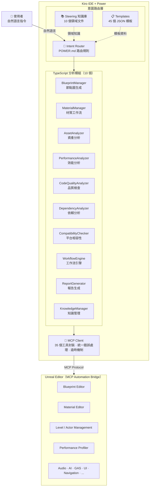

[English](README.md) | [繁體中文](README_TW.md) | [简体中文](README_CN.md) | [日本語](README_JP.md) | [한국어](README_KR.md)

# Kiro Unreal Accelerator

> **讓 AI 直接操作 Unreal Editor** — 不再只能生成 C++ code，而是直接在 Blueprint 裡建好節點、連好線、做好邏輯。

---

## 這個 Power 能幫你什麼？

Unreal 開發者長期面對一個痛點：**AI 只能幫你寫 C++ code，無法直接操作 Blueprint**。

這導致一個惡性循環：

1. 為了快速驗證，開發者在 Blueprint Editor 裡搭建原型
2. 驗證完成後，想用 AI 幫忙擴充 — 但 AI 只能生 C++ code
3. 要把 Blueprint 的邏輯搬到 C++，就得手動處理所有 reference 更新
4. C++ 不知道 Blueprint 裡的 class 和 struct，搬遷過程只能土砲
5. 有經驗的開發者乾脆一開始就從 C++ 寫起，犧牲了 Blueprint 的快速迭代優勢

**Kiro Unreal Accelerator 打破了這個循環。**

透過整合 35 個 MCP 工具，這個 Power 讓 AI 可以：

- **直接在 Blueprint 裡建立節點圖** — 支援 263 種節點類型，包含事件、函數呼叫、分支、變數存取等
- **自動連線、設定 Pin 預設值、編譯驗證** — 完整的 Blueprint 邏輯生成管線
- **建立材質、套用到場景、批次替換** — 材質工作流全自動化
- **分析效能、偵測反模式、生成報告** — 場景最佳化不再靠直覺
- **一句話建立完整關卡結構** — 從模板生成 open world、arena、interior 等關卡骨架
- **跨平台相容性檢查** — 自動驗證 iOS、Android、PS5、Xbox、Switch 的限制

你只需要用自然語言告訴 Kiro 你想做什麼，Power 會自動選擇正確的工具組合來完成。

---

## 目錄

- [運作原理](#運作原理)
- [安裝與設定](#安裝與設定)
- [核心模組詳解](#核心模組詳解)
  - [BlueprintManager — 藍圖邏輯生成](#blueprintmanager--藍圖邏輯生成)
  - [MaterialManager — 材質工作流](#materialmanager--材質工作流)
  - [AssetAnalyzer — 資產分析](#assetanalyzer--資產分析)
  - [PerformanceAnalyzer — 效能分析](#performanceanalyzer--效能分析)
  - [CodeQualityAnalyzer — 程式碼品質](#codequalityanalyzer--程式碼品質)
  - [DependencyAnalyzer — 依賴分析](#dependencyanalyzer--依賴分析)
  - [CompatibilityChecker — 平台相容性](#compatibilitychecker--平台相容性)
  - [WorkflowEngine — 工作流引擎](#workflowengine--工作流引擎)
  - [ReportGenerator — 報告生成](#reportgenerator--報告生成)
  - [KnowledgeManager — 知識管理](#knowledgemanager--知識管理)
- [模板系統](#模板系統)
- [Steering 知識庫](#steering-知識庫)
- [MCP 工具對照表](#mcp-工具對照表)
- [測試](#測試)
- [已知問題與疑難排解](#已知問題與疑難排解)
- [授權](#授權)

---

## 運作原理

### 架構概覽



### 三層設計

**1. 意圖路由層（Intent Routing）**

當你說「幫我建立一個角色 Blueprint」，Power 不是隨便挑一個工具來用。`POWER.md` 中定義了完整的意圖路由規則，根據你的描述自動選擇：
- 該查閱哪個 Steering 知識文件（例如 `steering/blueprint-patterns.md`）
- 該使用哪個模板（例如 `templates/blueprints/character-base.json`）
- 該呼叫哪些 MCP 工具（例如 `manage_blueprint` + `manage_character`）

**2. 分析模組層（TypeScript Modules）**

10 個 TypeScript 模組提供高階邏輯，不只是簡單地轉發 MCP 呼叫：
- `BlueprintManager` 會自動解析節點名稱到 nodeId 的映射，讓你用人類可讀的名稱來連線
- `PerformanceAnalyzer` 會並行執行 Draw Call、記憶體、GPU 分析，然後交叉比對產生綜合評分
- `DependencyAnalyzer` 用 DFS 演算法遍歷依賴圖，偵測循環依賴
- `WorkflowEngine` 支援條件分支和失敗策略（stop/skip/retry），不是單純的線性執行

**3. MCP 工具層（35 Tools）**

底層透過 MCP Protocol 與 Unreal Editor 通訊。`McpClient` 封裝了所有 35 個工具，提供：
- 統一的錯誤處理與逾時機制
- 依賴注入支援（方便測試）
- 完整的 TypeScript 型別定義

### 模板驅動

`templates/` 目錄包含 45 個 JSON 模板，涵蓋 10 個類別。模板不只是「設定檔」，而是經過驗證的最佳實踐：
- Blueprint 模板包含正確的元件階層、變數分類、函數簽名
- 材質模板包含節點連線圖、參數預設值、編譯設定
- 關卡骨架模板包含光照配置、導航設定、串流策略
- 平台設定檔包含各平台的記憶體預算、Shader Model 限制、Scalability 設定

### Steering 知識注入

`steering/` 目錄的 10 個 Markdown 文件是 Power 的「領域知識」。當你問材質相關問題時，Kiro 會先讀取 `steering/material-workflow.md`，確保回答基於正確的 MCP API 用法和已知的陷阱（例如 `connect_material_pins` 要用 `assetPath` 不是 `materialPath`）。

---

## 安裝與設定

### 前置需求

- [Unreal Engine 5.5+](https://www.unrealengine.com/)（支援 5.5 / 5.6 / 5.7）
- [Kiro IDE](https://kiro.dev/docs/getting-started/installation)
- Python 3.12+ 和 [uv](https://docs.astral.sh/uv/getting-started/installation/)（Local MCP 用）
- Node.js 18+（僅本 Power 開發/測試需要）
- （選用）[Flopperam API Key](https://flopperam.com/account) — 僅付費 Hosted MCP 需要

> **完整安裝步驟請參考下方安裝章節**

### 安裝步驟

```bash
# 安裝依賴
npm install

# 確認安裝正確
npx vitest run
```

### MCP 設定

本 Power 使用 [flopperam/unreal-engine-mcp](https://github.com/flopperam/unreal-engine-mcp) 作為 MCP Server，提供 50+ 工具涵蓋 Blueprint、材質、VFX、動畫、地形、AI、Cinematics、PCG 等 9 大領域。

#### 方式 1：Open-Source Local MCP（免費，推薦）

無需付費，本地運行開源版本：

**步驟 1 — Clone repo 到固定位置（不要放在 UE 專案裡面）**

```cmd
cd %USERPROFILE%\Desktop
git clone https://github.com/flopperam/unreal-engine-mcp.git
```

**步驟 2 — 複製 UnrealMCP Plugin 到你的 UE 專案**

在你的 UE 專案根目錄下執行：

```cmd
:: Windows (CMD) — 在 UE 專案根目錄下執行
xcopy /E /I "%USERPROFILE%\Desktop\unreal-engine-mcp\UnrealMCP" "Plugins\UnrealMCP"
```

```bash
# macOS / Linux — 在 UE 專案根目錄下執行
cp -r ~/Desktop/unreal-engine-mcp/UnrealMCP Plugins/
```

最終結構應該是：
```
你的UE專案/
├── Plugins/
│   └── UnrealMCP/          ← 只要這個資料夾
│       ├── Source/
│       ├── UnrealMCP.uplugin
│       └── ...
├── Content/
├── 你的專案.uproject
└── ...
```

**步驟 3 — 編譯並啟用 Plugin**

1. 右鍵你的 `.uproject` 檔案 → "Generate Visual Studio project files"
2. 開啟 `.sln`，選擇 **Development Editor** 作為 Build Target，按 Build
3. 開啟 Unreal Editor → Edit → Plugins → 搜尋 "UnrealMCP" → 啟用 → 重啟 Editor

**步驟 4 — 安裝 Python 環境**

1. 安裝 [Python 3.12+](https://www.python.org/downloads/)（安裝時勾選 "Add Python to PATH"）
2. 安裝 [uv](https://docs.astral.sh/uv/getting-started/installation/)（Python 套件執行器）：

```cmd
pip install uv
```

**步驟 5 — 驗證 Python Server 可以啟動**

```cmd
cd %USERPROFILE%\Desktop\unreal-engine-mcp\Python
uv run unreal_mcp_server_advanced.py
```

如果啟動無錯誤，按 Ctrl+C 停止。Kiro 會自動管理 Server 的啟停。

**步驟 6 — 設定 mcp.json**

Windows：
```json
{
  "mcpServers": {
    "unreal-engine": {
      "command": "uv",
      "args": [
        "--directory",
        "C:\\Users\\<你的使用者名稱>\\Desktop\\unreal-engine-mcp\\Python",
        "run",
        "unreal_mcp_server_advanced.py"
      ]
    }
  },
  "powers": {
    "mcpServers": {}
  }
}
```

macOS / Linux：
```json
{
  "mcpServers": {
    "unreal-engine": {
      "command": "uv",
      "args": [
        "--directory",
        "/Users/<你的使用者名稱>/Desktop/unreal-engine-mcp/Python",
        "run",
        "unreal_mcp_server_advanced.py"
      ]
    }
  },
  "powers": {
    "mcpServers": {}
  }
}
```

> 將路徑替換為你實際 clone 的位置。Windows 在 JSON 中必須使用雙反斜線 `\\`。

#### 方式 2：Hosted Flop MCP（付費，50+ 完整工具）

如果需要完整 50+ 工具且不想本地架設：

1. 前往 [flopperam.com/account](https://flopperam.com/account) 取得 API Key
2. 安裝 FlopAI Unreal Plugin — 參見 [flopperam.com/docs](https://flopperam.com/docs)（Installation 頁籤）
3. 設定 `mcp.json`：

```json
{
  "mcpServers": {
    "unreal-engine": {
      "url": "https://agent.flopperam.com/mcp",
      "headers": {
        "Authorization": "Bearer YOUR_API_KEY"
      }
    }
  }
}
```

### 安裝自動導引 Hook（必要）

此 Hook 確保 AI 在每次 prompt 時自動啟動 Power 並正確使用 MCP 工具：

```bash
mkdir -p .kiro/hooks
cp hooks/pre-unreal-tool.kiro.hook .kiro/hooks/
```

> 不安裝此 Hook 的話，你每次都需要手動提醒 AI 使用 MCP 工具。

### 驗證連線

在 Kiro 中輸入任何 Unreal 相關指令（例如「列出目前場景中的所有 Actor」）。如果 AI 正確回應，表示連線成功。

### 專案結構

```
src/
├── analyzers/          # 分析模組（5 個）
│   ├── AssetAnalyzer.ts         # 資產類型偵測、Nanite 驗證、預設套用
│   ├── PerformanceAnalyzer.ts   # Draw Call / 記憶體 / GPU / Nanite / Lumen 分析
│   ├── CodeQualityAnalyzer.ts   # 命名規範、循環依賴、BP/C++ 平衡
│   ├── DependencyAnalyzer.ts    # 依賴樹、孤立資產、Chunk 重複、World Partition
│   └── CompatibilityChecker.ts  # 平台相容性、Shader Model、記憶體預算
├── managers/           # 管理模組（2 個）
│   ├── BlueprintManager.ts      # Blueprint 建立、節點圖生成、模板系統
│   └── MaterialManager.ts       # 材質搜尋、套用、建立、替換
├── engine/
│   └── WorkflowEngine.ts        # 工作流定義、執行、條件分支、排程
├── generators/
│   └── ReportGenerator.ts       # JSON / Markdown 報告生成、儀表板
├── utils/
│   ├── mcp-client.ts            # 35 個 MCP 工具封裝
│   ├── knowledge-manager.ts     # 文件儲存、搜尋、API 變更追蹤
│   ├── cache.ts                 # 分析結果快取
│   └── logger.ts                # 日誌系統
├── types/              # TypeScript 型別定義
└── index.ts            # 主入口

steering/              # 10 個領域知識文件
templates/             # 45 個 JSON 模板（10 個類別）
```

---

## 核心模組詳解


### BlueprintManager — 藍圖邏輯生成

> 解決核心痛點：AI 不再只能生成 C++ code，而是直接在 Blueprint 裡建好節點、連好線、做好邏輯。

#### 為什麼需要這個模組？

傳統流程中，開發者在 Blueprint Editor 搭好原型後，如果想用 AI 擴充功能，只能讓 AI 生成 C++ code。但 C++ 不知道 Blueprint 裡的 class 和 struct，所以開發者必須：
1. 手動把 Blueprint 的邏輯搬到 C++
2. 更新所有 reference（因為 C++ 的路徑和 Blueprint 不同）
3. 處理型別轉換和序列化問題

BlueprintManager 讓 AI 直接在 Blueprint 裡操作，省去這整段轉換的痛苦。

#### 運作原理

BlueprintManager 透過 `manage_blueprint` MCP 工具與 Unreal Editor 的 Blueprint Editor 通訊。核心流程：

1. **建立 Blueprint** → 指定父類別、路徑
2. **建立 SCS 元件樹** → 加入 Mesh、Camera、Collision 等元件並設定父子關係
3. **加入變數與函數** → 定義資料結構和介面
4. **建立節點圖** → 在 Event Graph 或函數圖中建立節點
5. **自動連線** → `buildGraphLogic()` 會自動把你用名稱定義的連線解析為實際的 nodeId
6. **編譯驗證** → 確保所有連線正確、型別匹配

關鍵設計：`buildGraphLogic()` 接受人類可讀的節點名稱（如 `"BeginPlay"`、`"PrintHello"`），內部維護一個 `nodeIdMap`（名稱 → nodeId 映射），讓連線定義不需要知道 Unreal 內部的 ID。

#### 支援的節點類型（263 種）

| 節點類型 | 用途 | 常用 Pin |
|---------|------|---------|
| `K2Node_Event` | 事件（BeginPlay, Tick） | `then` (exec out) |
| `K2Node_CallFunction` | 函數呼叫 | `execute` (exec in), `then` (exec out) |
| `K2Node_IfThenElse` | Branch 條件分支 | `condition` (bool in), `true`/`false` (exec out) |
| `K2Node_VariableGet` | 取得變數值 | 變數名稱 (data out) |
| `K2Node_VariableSet` | 設定變數值 | `execute` (exec in), 變數名稱 (data in) |
| `K2Node_CustomEvent` | 自訂事件 | `then` (exec out) |
| `K2Node_Timeline` | Timeline | Play/Stop (exec in), Update/Finished (exec out) |
| `K2Node_SpawnActorFromClass` | 生成 Actor | `execute` (exec in), Class (class in) |
| `K2Node_DynamicCast` | 動態 Cast | Object (object in), As XXX (object out) |

> 注意：Pin 名稱在 MCP bridge 中是小寫（`then`, `execute`，不是 `Then`, `Execute`）。


#### 功能列表

| 方法 | 說明 |
|---|---|
| `createBlueprint` | 一次完成：建立 BP → 加元件 → 加變數 → 加函數 → 建圖邏輯 → 編譯 |
| `createFromTemplate` | 從 JSON 模板一鍵生成完整 Blueprint |
| `buildGraphLogic` | 批次建立節點和連線（核心方法） |
| `createNode` | 建立單一節點 |
| `connectPins` | 連接兩個節點的 Pin |
| `setNodePinDefault` | 設定 Pin 預設值 |
| `addComponent` | 新增 SCS 元件 |
| `addVariable` / `removeVariable` | 管理變數 |
| `addFunction` / `addEvent` | 管理函數與事件 |
| `getBlueprintInfo` / `getGraphDetails` / `getNodeDetails` | 查詢 Blueprint 資訊 |
| `listNodeTypes` | 列出可用節點類型 |
| `compileBlueprint` | 編譯 Blueprint |
| `addBeginPlayEvent` / `addTickEvent` | 快速建立常見事件節點 |
| `addFunctionCallNode` / `addBranchNode` / `addPrintStringNode` | 快速建立常見邏輯節點 |
| `addVariableGetNode` / `addVariableSetNode` | 快速建立變數存取節點 |

#### 使用範例

**建立完整角色 Blueprint（自然語言）：**
```
幫我建立一個角色 Blueprint BP_MyCharacter，繼承 Character，
加上 SpringArm 和 Camera 元件，加一個 Health 變數（Float, 預設 100），
加一個 TakeDamage 函數
```

**建立完整角色 Blueprint（程式化 API）：**
```typescript
const manager = new BlueprintManager(mcpClient, cacheManager);
const result = await manager.createBlueprint({
  name: 'BP_MyCharacter',
  path: '/Game/Blueprints',
  parentClass: 'Character',
  components: [
    { name: 'SpringArm', componentClass: 'SpringArmComponent', attachTo: 'CapsuleComponent' },
    { name: 'Camera', componentClass: 'CameraComponent', attachTo: 'SpringArm' },
  ],
  variables: [
    { name: 'Health', type: 'Float', defaultValue: 100.0, category: 'Stats', isPublic: true },
  ],
  functions: [
    { name: 'TakeDamage', inputs: [{ name: 'Amount', type: 'Float' }] },
  ],
  compile: true,
  save: true,
});
```

**在 Event Graph 中建立邏輯（程式化 API）：**
```typescript
const graphResult = await manager.buildGraphLogic(
  '/Game/Blueprints/BP_MyActor',
  {
    graphName: 'EventGraph',
    nodes: [
      { nodeType: 'K2Node_Event', name: 'BeginPlay', posX: 0, posY: 0, memberName: 'ReceiveBeginPlay' },
      { nodeType: 'K2Node_CallFunction', name: 'PrintHello', posX: 400, posY: 0,
        memberClass: 'KismetSystemLibrary', memberName: 'PrintString' },
    ],
    connections: [
      // 用名稱引用，不需要知道 nodeId
      { fromNodeId: 'BeginPlay', fromPin: 'Then', toNodeId: 'PrintHello', toPin: 'Execute' },
    ],
  }
);
// graphResult.nodeIdMap → { BeginPlay: "actual_id_1", PrintHello: "actual_id_2" }
```

**從模板建立（自然語言）：**
```
用 character-base 模板建立一個新的角色 Blueprint，放在 /Game/Characters
```

---


### MaterialManager — 材質工作流

> 材質的搜尋、建立、套用、替換全自動化，包含已驗證的 MCP API 陷阱迴避。

#### 運作原理

MaterialManager 封裝了三個 MCP 工具的協作：
- `manage_asset` — 搜尋材質資產、連接材質節點到結果 Pin
- `manage_material_authoring` — 建立材質、加入節點（Noise、Lerp、參數等）、設定屬性
- `control_actor` — 套用材質到場景中的 Actor

關鍵知識：材質節點連線到結果節點（BaseColor、Roughness 等）時，不能用 `manage_material_authoring` 的 `connect_nodes`，必須用 `manage_asset` 的 `connect_material_pins`，且參數名稱是 `assetPath`（不是 `materialPath`）。這些陷阱已經封裝在 MaterialManager 內部。

#### 已驗證的材質套用方案

直接用 `set_component_property` 設定 `OverrideMaterials` 在 MCP bridge 中是壞的（永遠回報成功但值不變）。

**可靠方案：Blueprint SCS 方式**
1. 建立 Blueprint（`manage_blueprint` → `create`）
2. 用 `add_scs_component` 加入 StaticMeshComponent，同時指定 `meshPath` 和 `materialPath`
3. 確認回傳 `mesh_applied: true` 和 `material_applied: true`
4. 用 `control_actor` → `spawn_blueprint` 生成到場景中

#### 功能列表

| 方法 | 說明 |
|---|---|
| `searchMaterials` | 搜尋專案中的材質（支援路徑、類型、數量限制） |
| `getMaterialInfo` | 取得材質詳細資訊（類型、參數、父材質） |
| `applyMaterialToActor` | 套用材質到單一 Actor |
| `batchApplyMaterial` | 批次套用材質到多個 Actor |
| `findActors` | 搜尋場景中的 Actor（依名稱/標籤/類別） |
| `getActorMaterials` | 查詢 Actor 目前使用的材質 |
| `replaceMaterial` | 替換場景中所有使用特定材質的 Actor |
| `createMaterial` | 建立新材質（自動建立節點與連線） |
| `createMaterialInstance` | 從父材質建立實例並覆寫參數 |

#### 使用範例

```
幫我找出專案中所有可用的材質
把 /Game/Materials/M_Brick 材質套用到 StaticMeshActor_21
把場景中所有使用 MI_OldMaterial 的物件都換成 MI_NewMaterial
幫我建立一個紅色金屬材質，粗糙度 0.3，金屬度 0.9
從 M_Master 建立一個材質實例 MI_BluePlastic，Base Color 設為藍色
```

---

### AssetAnalyzer — 資產分析

> 自動偵測資產類型、驗證 Nanite 相容性、分析問題並批次套用預設。

#### 運作原理

AssetAnalyzer 透過 `inspect` 和 `manage_asset` 工具讀取資產的元資料（面數、骨骼數、貼圖大小等），然後根據預設規則判斷：
- 資產類型（Texture2D、StaticMesh、SkeletalMesh、Blueprint 等）
- Nanite 相容性（高面數 + 無骨骼 + 無變形 = 適合 Nanite）
- 潛在問題（過大的貼圖、未壓縮的音訊、缺少 LOD 等）
- 建議的預設設定（從 `templates/presets/` 中匹配）

批次套用預設時，會先驗證每個資產是否符合預設的前置條件，不符合的會回傳原因和替代建議。

#### 功能列表

| 方法 | 說明 |
|---|---|
| `detectAssetType` | 根據路徑與元資料偵測資產類型 |
| `validateNaniteCompatibility` | 檢查網格是否符合 Nanite 需求 |
| `analyzeAsset` | 完整分析單一資產（類型、問題、建議、記憶體估算） |
| `batchApplyPreset` | 批次套用預設，驗證不通過時回傳原因與替代建議 |

#### 使用範例

```
幫我分析 /Game/Meshes/SM_Building 這個資產，看看有什麼問題
這個網格 SM_HighPolyRock 可以用 Nanite 嗎？
把這些網格都套用 Nanite 預設設定：SM_Rock01, SM_Rock02, SM_Rock03
```

---


### PerformanceAnalyzer — 效能分析

> 場景效能全面分析：Draw Call、記憶體、GPU、Nanite/Lumen 使用狀況與反模式偵測。

#### 運作原理

`analyzeScene()` 會並行執行五個子分析（Draw Call、記憶體、GPU、Nanite、Lumen），然後交叉比對結果產生：
- 0-100 的綜合效能評分
- 預估 FPS 範圍（low / mid / high 硬體）
- 偵測到的反模式（5 種常見類型）
- 按優先級排序的最佳化建議

五種反模式偵測：
1. **動態光源過多** — 超過閾值的動態光源會大幅增加 Draw Call
2. **未合併網格** — 大量小型靜態網格未使用 HISM 或 Merge Actor
3. **過大貼圖** — 超過 4K 的貼圖在非必要場景浪費記憶體
4. **高材質指令數** — 材質複雜度過高影響 GPU 效能
5. **過多 Tick** — 大量 Actor 啟用 Tick 造成 Game Thread 瓶頸

#### 功能列表

| 方法 | 說明 |
|---|---|
| `analyzeScene` | 完整場景效能分析（並行執行所有子分析） |
| `profileDrawCalls` | Draw Call 統計（靜態/骨骼網格/粒子/UI） |
| `profileMemory` | 記憶體使用分析（貼圖/網格/音訊/腳本） |
| `analyzeNaniteUsage` | Nanite 啟用狀態、三角形分佈、Streaming Pool |
| `analyzeLumenSettings` | Lumen GI/反射/光線追蹤設定分析 |
| `detectAntiPatterns` | 偵測 5 種常見反模式 |

#### 使用範例

```
幫我分析目前場景的效能，看看有什麼問題
目前場景的 Draw Call 是多少？有沒有太高？
場景的記憶體使用狀況如何？貼圖佔了多少？
幫我檢查場景中有沒有效能反模式
目前場景的 Nanite 使用狀況如何？
```

---

### CodeQualityAnalyzer — 程式碼品質

> 檢查命名規範、偵測循環依賴、分析 Blueprint/C++ 職責分配並提供重構建議。

#### 運作原理

- **命名規範檢查**：根據 UE 標準前綴規則（T_ 貼圖、SM_ 靜態網格、BP_ 藍圖、M_ 材質等）掃描所有資產
- **循環依賴偵測**：用 DFS 演算法遍歷資產依賴圖，找出所有環路
- **BP/C++ 平衡分析**：統計 Blueprint 和 C++ 的比例，標記過於複雜的 Blueprint（應該搬到 C++）和過於簡單的 C++ 類別（可以用 Blueprint）
- **重構建議**：針對指定資產分析其複雜度、依賴關係、命名問題，提供 rename / extract / split 建議

#### 功能列表

| 方法 | 說明 |
|---|---|
| `analyzeProject` | 完整專案品質分析（並行執行所有子分析） |
| `checkNamingConventions` | 檢查 UE 命名規範 |
| `detectCircularDependencies` | DFS 偵測循環依賴 |
| `analyzeBlueprintCppBalance` | 分析 Blueprint/C++ 比例 |
| `suggestRefactoring` | 針對指定資產提供重構建議 |

#### 使用範例

```
幫我檢查整個專案的程式碼品質
專案中有哪些資產的命名不符合 UE 規範？
專案中有沒有循環依賴的問題？
我的專案 Blueprint 和 C++ 的比例合理嗎？
BP_GameManager 這個 Blueprint 需要重構嗎？
```

---

### DependencyAnalyzer — 依賴分析

> 建立依賴樹、偵測孤立資產、分析 Chunk 重複與刪除影響，支援 World Partition。

#### 運作原理

透過 `manage_asset` 的 `get_dependencies` 遞迴建立完整的依賴樹。每個節點記錄直接依賴和間接依賴，計算最大深度和總依賴數。

孤立資產偵測會反向掃描：找出沒有被任何其他資產引用的資產，這些通常是可以安全刪除的。

Chunk 重複分析檢查打包後的資產分配，找出被放到多個 Chunk 的資產（造成包體膨脹）。

#### 功能列表

| 方法 | 說明 |
|---|---|
| `buildDependencyTree` | 從指定資產建立完整依賴樹 |
| `findOrphanedAssets` | 偵測沒有任何參照的孤立資產 |
| `analyzeChunkDuplication` | 檢查資產是否被分配到多個 Chunk |
| `getImpactAnalysis` | 分析刪除某資產會影響哪些其他資產 |
| `analyzeWorldPartitionDependencies` | 分析 World Partition Data Layer 之間的依賴 |

#### 使用範例

```
幫我看看 BP_MainCharacter 依賴了哪些資產
專案中有沒有沒被任何東西引用的孤立資產？
如果我刪除 M_OldMaterial，會影響到哪些東西？
打包後有沒有資產被重複放到多個 Chunk？
分析 World Partition 的 Data Layer 之間有沒有不合理的依賴
```

---


### CompatibilityChecker — 平台相容性

> 檢查專案在 8 個平台的相容性：Windows、Mac、Linux、iOS、Android、PS5、Xbox Series X、Switch。

#### 運作原理

每個平台有對應的設定檔（`templates/platform-profiles/`），定義了：
- 支援的 Shader Model / Feature Level
- 記憶體預算（例如 Android 3072 MB、iOS 2048 MB）
- 功能限制（例如 Switch 不支援 Nanite）
- Scalability 設定建議

CompatibilityChecker 會把專案目前的設定與目標平台的限制做比對，產生：
- `canBuild` — 是否可以建置
- `blockingIssues` — 阻擋建置的嚴重問題
- Shader 相容性報告
- 記憶體預算報告

#### 功能列表

| 方法 | 說明 |
|---|---|
| `checkPlatform` | 完整平台相容性檢查 |
| `checkShaderCompatibility` | 檢查 Shader Model / Feature Level 相容性 |
| `checkMemoryBudget` | 驗證記憶體使用是否符合平台預算 |
| `validateScalabilitySettings` | 驗證 Scalability 設定在不同品質等級的相容性 |

#### 使用範例

```
我的專案可以在 iOS 上跑嗎？有什麼問題？
專案的 Shader 在 PS5 上都相容嗎？
目前的記憶體使用在 Android 上會不會超標？
我的 Scalability 設定在低品質等級有沒有問題？
```

---

### WorkflowEngine — 工作流引擎

> 定義、執行與排程多步驟工作流，支援條件分支與失敗策略。

#### 運作原理

WorkflowEngine 不是簡單的「依序執行」。每個步驟可以設定：
- **失敗策略** — `stop`（中斷整個工作流）、`skip`（跳過繼續）、`retry`（重試 N 次）
- **條件分支** — 根據前一步驟的結果決定是否執行（支援 eq、neq、gt、lt、contains 運算子）
- **排程** — 用 Cron 表達式定期執行

工作流可以從 `templates/workflows/` 載入預定義的流程（資產匯入、效能審計、材質替換、建置測試）。

#### 功能列表

| 方法 | 說明 |
|---|---|
| `defineWorkflow` | 定義工作流（步驟、條件、失敗策略） |
| `executeWorkflow` | 依序執行工作流所有步驟 |
| `scheduleWorkflow` | 排程工作流（Cron 表達式） |
| `evaluateCondition` | 評估步驟條件 |
| `listWorkflows` / `getWorkflowStatus` | 查詢工作流狀態 |

#### 使用範例

```
幫我執行資產匯入工作流：先偵測類型、再套用預設、最後驗證
如果效能分數低於 60 分，就執行最佳化步驟
每天凌晨 2 點自動執行效能審計工作流
```

---

### ReportGenerator — 報告生成

> 將分析結果轉換為 JSON 或 Markdown 格式的報告，支援專案健康儀表板。

#### 功能列表

| 方法 | 說明 |
|---|---|
| `generateAssetReport` | 生成資產分析報告 |
| `generatePerformanceReport` | 生成效能分析報告 |
| `generateCodeQualityReport` | 生成程式碼品質報告 |
| `generateCompatibilityReport` | 生成相容性報告 |
| `generateDashboard` | 生成專案健康儀表板（合併多份報告） |

#### 使用範例

```
幫我生成一份效能分析報告，用 Markdown 格式
幫我生成一份專案整體健康報告，包含效能、品質、相容性
```

---

### KnowledgeManager — 知識管理

> 團隊知識的集中儲存與檢索、過期偵測、UE API 變更追蹤。

#### 運作原理

KnowledgeManager 提供一個輕量的文件資料庫，支援：
- **全文搜尋** — 比對 title、content、tags 三個欄位
- **過期偵測** — 根據 `lastUpdated` 時間戳找出需要更新的文件
- **API 變更追蹤** — 記錄 UE 版本間的 API 變更（重新命名、移除、參數變更），並追蹤受影響的程式碼路徑

#### 功能列表

| 方法 | 說明 |
|---|---|
| `storeDocument` / `getDocument` | 儲存與檢索文件 |
| `searchDocuments` | 全文搜尋 |
| `getExpiredDocuments` | 取得超過閾值的過期文件 |
| `trackApiChange` | 追蹤 API 變更記錄 |
| `getAffectedCode` | 取得受 API 變更影響的程式碼路徑 |

#### 使用範例

```
幫我記錄一下：Nanite 不支援骨骼網格
UE 5.4 把 SetActorLocation 改名了，幫我記錄這個變更
有哪些團隊文件超過 30 天沒更新了？
```

---


## 模板系統

`templates/` 目錄包含 45 個 JSON 模板，涵蓋 10 個類別。每個模板都是經過驗證的最佳實踐，不只是設定檔。

| 目錄 | 數量 | 說明 | 包含模板 |
|---|---|---|---|
| `presets/` | 7 | 資產預設設定 | `texture-2d-diffuse`, `texture-2d-normal`, `static-mesh-nanite`, `static-mesh-standard`, `skeletal-mesh-character`, `material-pbr`, `sound-sfx` |
| `scaffolds/` | 4 | 關卡骨架 | `open-world`, `linear-level`, `arena`, `interior` |
| `blueprints/` | 6 | Blueprint 模板 | `character-base`, `actor-interactable`, `component-health`, `widget-hud`, `gamemode-base`, `ai-controller` |
| `materials/` | 4 | 材質模板 | `pbr-standard`, `pbr-subsurface`, `landscape-blend`, `vfx-translucent` |
| `gas/` | 5 | GAS 模板 | `ability-melee`, `ability-projectile`, `effect-damage`, `effect-buff`, `attribute-set-base` |
| `ai/` | 4 | AI 行為模板 | `behavior-tree-patrol`, `behavior-tree-combat`, `blackboard-npc`, `eqs-find-cover` |
| `build-configs/` | 3 | 建置設定 | `development`, `shipping`, `test` |
| `platform-profiles/` | 5 | 平台設定檔 | `windows`, `ps5`, `xbox-series-x`, `ios`, `android` |
| `architecture-rules/` | 3 | 架構規則 | `naming-conventions`, `folder-structure`, `dependency-rules` |
| `workflows/` | 4 | 工作流模板 | `asset-import-pipeline`, `build-and-test`, `performance-audit`, `material-swap` |

### 使用方式

**自然語言：**
```
用 character-base 模板建立一個角色 Blueprint
用 open-world 骨架建立一個新關卡
用 pbr-standard 模板建立一個材質
執行 performance-audit 工作流
```

**程式化 API：**
```typescript
import template from './templates/blueprints/character-base.json';
const result = await blueprintManager.createFromTemplate({
  template,
  path: '/Game/Blueprints',
  nameOverride: 'BP_MyCharacter',
  compile: true,
  save: true,
});
```

---

## Steering 知識庫

`steering/` 目錄包含 10 個領域知識文件。Kiro 在回答相關問題前會自動參考對應的文件，確保建議基於正確的 API 用法和已知陷阱。

| 文件 | 領域 | 涵蓋內容 |
|---|---|---|
| `material-workflow.md` | 材質工作流 | 材質搜尋/套用/建立/替換流程、MCP API 陷阱（`connect_material_pins` 參數名稱、結果節點連線方式） |
| `blueprint-logic.md` | 藍圖邏輯 | 節點圖生成工作流、263 種節點類型速查、memberClass 速查、Pin 名稱規則 |
| `performance.md` | 效能最佳化 | Draw Call 最佳化策略、記憶體管理、GPU 瓶頸分析、5 種反模式 |
| `architecture.md` | 架構設計 | Blueprint vs C++ 職責分配原則、模組化設計、命名規範 |
| `asset-pipeline.md` | 資產管線 | 資產匯入流程、貼圖壓縮設定、網格 LOD 設定、音訊設定 |
| `blueprint-patterns.md` | 藍圖模式 | Blueprint 設計模式（Component Pattern、Interface Pattern）、反模式、最佳實踐 |
| `ue5-features.md` | UE5 功能 | Nanite、Lumen、World Partition、Control Rig、Virtual Shadow Maps 的使用指南 |
| `platform-compat.md` | 平台相容性 | 各平台 Shader Model 對應、記憶體預算、功能限制 |
| `gas-patterns.md` | GAS 模式 | Ability/Effect/Attribute 設計模式、Tag 階層設計、堆疊策略 |
| `ui-patterns.md` | UI/UMG 模式 | Widget 設計模式、Common UI 整合、UI 效能最佳化 |

---


## MCP 工具對照表

所有工具在執行時帶有 `mcp_unreal_engine_` 前綴。Power 會根據你的意圖自動選擇正確的工具組合。

| 使用者意圖 | 主要 MCP 工具 | 輔助工具 |
|---|---|---|
| 匯入/設定資產 | `manage_asset` | `inspect`, `manage_texture` |
| 建立/修改 Blueprint | `manage_blueprint` | `inspect`, `manage_asset` |
| 生成/移動 Actor | `control_actor` | `inspect`, `manage_level` |
| 播放/停止 PIE、截圖 | `control_editor` | `system_control` |
| 載入/儲存/串流關卡 | `manage_level` | `manage_level_structure`, `manage_volumes` |
| 建立地形、植被 | `build_environment` | `manage_asset`, `manage_material_authoring` |
| 動畫、物理、布娃娃 | `animation_physics` | `manage_skeleton`, `manage_asset` |
| 編輯 Level Sequence | `manage_sequence` | `control_actor`, `control_editor` |
| 建立輸入動作/映射 | `manage_input` | `manage_blueprint` |
| 檢查 UObject 屬性 | `inspect` | — |
| 播放/設定音訊 | `manage_audio` | `manage_asset`, `inspect` |
| 建立行為樹 | `manage_behavior_tree` | `manage_ai`, `manage_blueprint` |
| 生成/設定燈光 | `manage_lighting` | `manage_level`, `build_environment` |
| 效能分析/最佳化 | `manage_performance` | `system_control`, `inspect` |
| 建立程序化幾何 | `manage_geometry` | `manage_asset`, `manage_material_authoring` |
| 編輯骨骼網格/Socket | `manage_skeleton` | `animation_physics`, `manage_asset` |
| 搜尋/套用材質 | `control_actor` | `manage_asset`, `manage_material_authoring` |
| 編輯材質圖 | `manage_material_authoring` | `manage_asset`, `manage_texture` |
| 建立/處理貼圖 | `manage_texture` | `manage_asset` |
| 建立 GAS 技能/效果 | `manage_gas` | `manage_blueprint`, `manage_character` |
| 建立角色 Blueprint | `manage_character` | `manage_blueprint`, `animation_physics` |
| 設定武器/戰鬥 | `manage_combat` | `manage_blueprint`, `manage_gas` |
| 建立 AI 控制器/EQS | `manage_ai` | `manage_behavior_tree`, `manage_blueprint` |
| 建立物品/背包 | `manage_inventory` | `manage_blueprint`, `manage_asset` |
| 建立門/開關/觸發器 | `manage_interaction` | `control_actor`, `manage_blueprint` |
| 建立 UMG Widget/HUD | `manage_widget_authoring` | `manage_blueprint`, `manage_asset` |
| 設定網路複製/RPC | `manage_networking` | `manage_blueprint`, `manage_game_framework` |
| 建立 GameMode/GameState | `manage_game_framework` | `manage_blueprint`, `manage_networking` |
| 設定分割畫面/LAN | `manage_sessions` | `manage_game_framework`, `manage_networking` |
| 建立子關卡/World Partition | `manage_level_structure` | `manage_level`, `manage_volumes` |
| 建立觸發/物理 Volume | `manage_volumes` | `manage_level`, `control_actor` |
| 設定 NavMesh/尋路 | `manage_navigation` | `manage_volumes`, `control_actor` |
| 建立/編輯 Spline | `manage_splines` | `manage_asset`, `manage_material_authoring` |
| 執行主控台指令、CVar | `system_control` | `control_editor` |
| 啟用/停用 MCP 工具 | `manage_tools` | — |

---

## 測試

本專案包含 313 個測試，涵蓋 13 個測試檔案。

```bash
# 執行所有測試
npx vitest run

# 執行單一測試檔案
npx vitest run src/__tests__/managers/BlueprintManager.test.ts

# 查看覆蓋率
npx vitest run --coverage
```

| 測試檔案 | 測試對象 |
|---|---|
| `src/__tests__/managers/BlueprintManager.test.ts` | BlueprintManager |
| `src/__tests__/managers/MaterialManager.test.ts` | MaterialManager |
| `src/__tests__/analyzers/AssetAnalyzer.test.ts` | AssetAnalyzer |
| `src/__tests__/analyzers/PerformanceAnalyzer.test.ts` | PerformanceAnalyzer |
| `src/__tests__/analyzers/CodeQualityAnalyzer.test.ts` | CodeQualityAnalyzer |
| `src/__tests__/analyzers/DependencyAnalyzer.test.ts` | DependencyAnalyzer |
| `src/__tests__/analyzers/CompatibilityChecker.test.ts` | CompatibilityChecker |
| `src/__tests__/engine/WorkflowEngine.test.ts` | WorkflowEngine |
| `src/__tests__/generators/ReportGenerator.test.ts` | ReportGenerator |
| `src/__tests__/utils/knowledge-manager.test.ts` | KnowledgeManager |
| `src/__tests__/utils/mcp-client.test.ts` | MCP Client |
| `src/__tests__/utils/cache.test.ts` | Cache |
| `src/__tests__/utils/logger.test.ts` | Logger |

---


## 快速示範：建立互動場景並執行品質檢查

> 以下示範使用一個第三人稱射擊場景作為範例。相同的工作流步驟（場景建立、品質檢查、效能分析、平台相容性）適用於任何 Unreal 專案。

### 階段 1：建立場景

首先，建立一個可遊玩的 3D 場景：

```
建立一個 Arena 類型的關卡，包含：
- 地形（平坦的競技場地面）
- 方向光和天空光
- 第三人稱角色（WASD 移動 + 滑鼠視角）
- 4 個掩體物件散佈在場景中
- HUD 顯示血量和彈藥數
命名為 Level_Arena01 並儲存
```

接著，加入互動機制：

```
建立一個可互動的武器拾取物：
1. 建立 BP_Pickup_Rifle Blueprint，繼承 Actor
2. 加入 StaticMeshComponent 和 SphereCollision
3. 實作 BPI_Interactable 介面
4. 靠近時顯示提示文字，按 E 拾取
5. 拾取後播放音效並銷毀 Actor
```

建立一個 GAS 技能：

```
用 ability-melee 模板建立一個近戰攻擊技能 GA_MeleeAttack，
設定冷卻 1.5 秒、消耗 20 體力、造成 50 物理傷害
```

### 階段 2：品質檢查與最佳化

執行程式碼品質檢查：

```
檢查所有 Blueprint 和 C++ 的命名規範、層級依賴和循環引用，
列出所有違規項目並提供修復建議
```

掃描效能問題：

```
分析目前場景的 Draw Call、記憶體使用和 GPU 負載，
偵測效能反模式，生成按嚴重度排序的完整效能報告
```

驗證跨平台相容性：

```
檢查專案在 Android 和 iOS 平台的相容性，
驗證 Shader Model、記憶體預算，分類問題為 Error/Warning/Suggestion
```

---


## 已知問題與疑難排解

### 危險操作

#### 絕對不要用 `ce` 主控台指令

`ce`（CallEvent）指令透過 MCP 執行會導致 Unreal Editor 立即崩潰（SEGFAULT in `UEngine::HandleCeCommand`）。永遠使用專用的 MCP 工具 action 來替代。

#### `set_component_property` + `OverrideMaterials` 永遠失敗

這個組合在 MCP bridge 中是壞的 — 永遠回報 `success: true` 但值不變。使用 Blueprint SCS 方式替代（見 [MaterialManager 章節](#materialmanager--材質工作流)）。

#### 不要用大量 Undo 來還原批次操作

連續 Undo 40+ 次會超過目標，破壞不相關的場景狀態。改用針對性的還原（重新套用原始材質/設定）。

### MCP API 陷阱

| 陷阱 | 正確做法 |
|---|---|
| 材質連線到結果節點用 `manage_material_authoring` 的 `connect_nodes` | 改用 `manage_asset` 的 `connect_material_pins` |
| `connect_material_pins` 用 `materialPath` 參數 | 正確參數名是 `assetPath` |
| Texture Sample 的 UV 輸入 Pin 叫 `UVs` | 正確名稱是 `Coordinates` |
| `get_material_info` 查詢 MaterialInstance | 只支援 Material 類型，MaterialInstance 改用 `inspect` → `get_material_details` |
| Blueprint `connect_pins` 用 `fromPin` / `toPin` | 正確參數名是 `fromPinName` / `toPinName` |
| Blueprint Pin 名稱首字母大寫（`Then`, `Execute`） | MCP bridge 中是小寫（`then`, `execute`） |
| `add_node` 建立事件節點不帶 `eventName` | K2Node_Event 需要 `eventName` 參數 |
| `add_node` 建立函數呼叫不帶 `functionName` | K2Node_CallFunction 需要 `functionName` 參數 |

### 常見問題

**Q: MCP 連線失敗？**
1. 確認 Unreal Editor 已開啟且 FlopAI Plugin 正在運行
2. 確認 API Key 正確（Hosted 版本）
3. 檢查 `mcp.json` 或 `.kiro/settings/mcp.json` 設定
4. 在 Kiro 指令面板搜尋 "MCP" 重新連線
5. 參考 [flopperam.com/docs](https://flopperam.com/docs) 的 Debugging & Troubleshooting Guide

**Q: Blueprint 編譯失敗？**
- 用 `listNodeTypes()` 確認節點類型名稱正確
- 用 `getNodeDetails()` 確認 Pin 名稱正確
- 檢查所有必要的 exec 和 data 連線是否完整

**Q: 測試執行失敗？**
```bash
rm -rf node_modules
npm install
npx vitest run
```

---

## 安全

詳見 [CONTRIBUTING](CONTRIBUTING.md#security-issue-notifications)。

## 授權

本專案使用 MIT License 授權。詳見 [LICENSE](LICENSE) 檔案。
